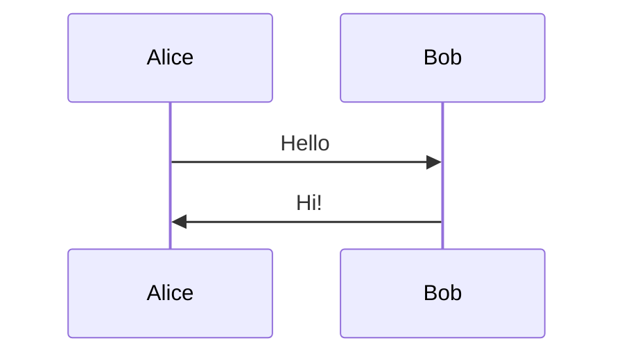

# Orca

Orca is an open-source Markdown editor desktop app and a Typora alternative, built with Electron, React, and TypeScript.


## Features

- File tree and workspace browsing
- WYSIWYG Markdown editing with live source sync
- Tables, math, code blocks, and lists
- Mermaid diagrams (sequence, flowchart, class, etc.)
- Drag-and-drop opening for local `.md` files
- Export to HTML, PDF, and Word
- Local image path handling for project-relative assets
- Smart table navigation: ArrowUp at first row inserts paragraph before table at document start

## Development

```bash
npm install
npm run dev
```

## Build

```bash
npm run build:mac
npm run build:win
npm run build:linux
```

## License

MIT. See [LICENSE](./LICENSE).

## Mermaid Diagrams

Write diagrams using `mermaid` code blocks:



Click the rendered diagram to edit the source code.
